# Comisión 2403 - Grupo 02
# Curso Devops - PIN FINAL

## Integrantes:
* German Montori <gerlm86@gmail.com>
* Guillermo Getar <guillermo.getar@unc.edu.ar>
* Mauro Pereira <mauro.a.pereira@gmail.com>
* Santiago Gordillo <arielgordillolucas@gmail.com>

## Introducción
Este proyecto tiene como idea principal el aprendizaje sobre
distintos temas y la puesta enpráctica
mediante un laboratorio que permita
integrar diferentes herramientas y
tecnologías.
Durante la primera parte nos centramos
en la creación de una instancia de EC2
en AWS para poder desde allí realizar
todas las tareas necesarias.
Por último, configuramos la parte de
monitoreo de pods con el stack de
Prometheus y Grafana.

## Flujo de trabajo
* Creación de cuenta de AWS junto a los permisos necesarios.
* Instalación y configuración de EKS.
* Creación del cluster.
* Chequeo de cluster.
* Despliegue de Prometheus. 
* Chequeo de despliegue de Prometheus.
* Despliegue de Grafana. 
* Chequeo de despliegue de Grafana.
* Configuración de dashboard.
* Conclusión.

## Creación de cuenta de AWS junto a los permisos necesarios
Se reutiliza el usuario del PIN2 **aws_cli_user** pero agregando la política **AmazonEC2FullAccess**.

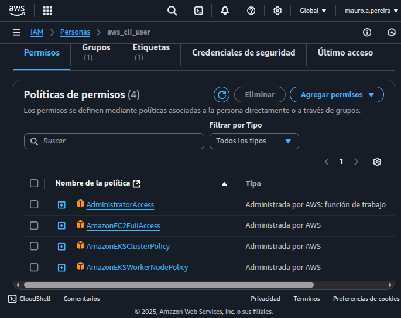

## Instalación y configuración de EKS
La instalación de programas como **kubectl**, **docker-compose**, **helm** y **terraform** se lleva a cabo a
través de un script llamado **install_tools.sh**, el cual también configura los PATH para que **eksctl**
pueda acceder a ellos. **eksctl** es un cli para crear y administrar los cluster en **Amazon EKS** por
comandos. Es importante configurar bien el usuario de **aws_cli_user**.

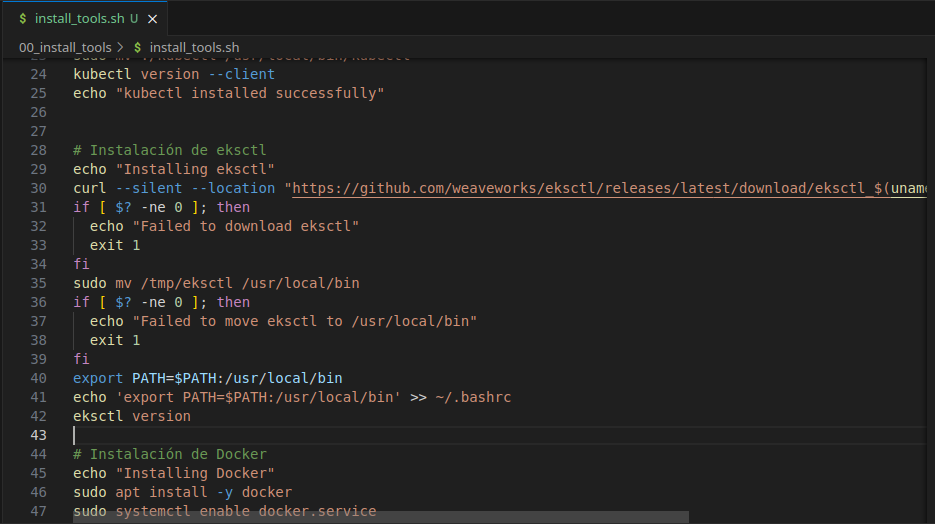

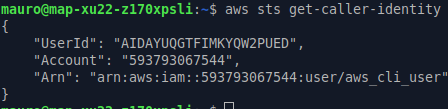

## Creación del cluster
A través del script **create_cluster.sh** se crea un cluster cuyas propiedades se definen a través
de variables, como el nombre, el nombre del grupo al que pertenece, la contraseña, las zonas,
etc. También importa las claves ssh e incluye la opción **--delete** que se encarga de eliminar todo
lo creado por el script, para no incurrir en gastos innecesarios o en la etapa desarrollo, para
ir probando las distintas configuraciones.

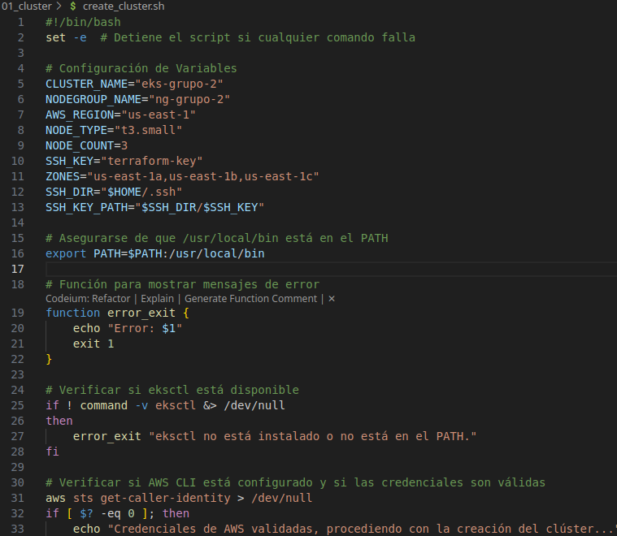

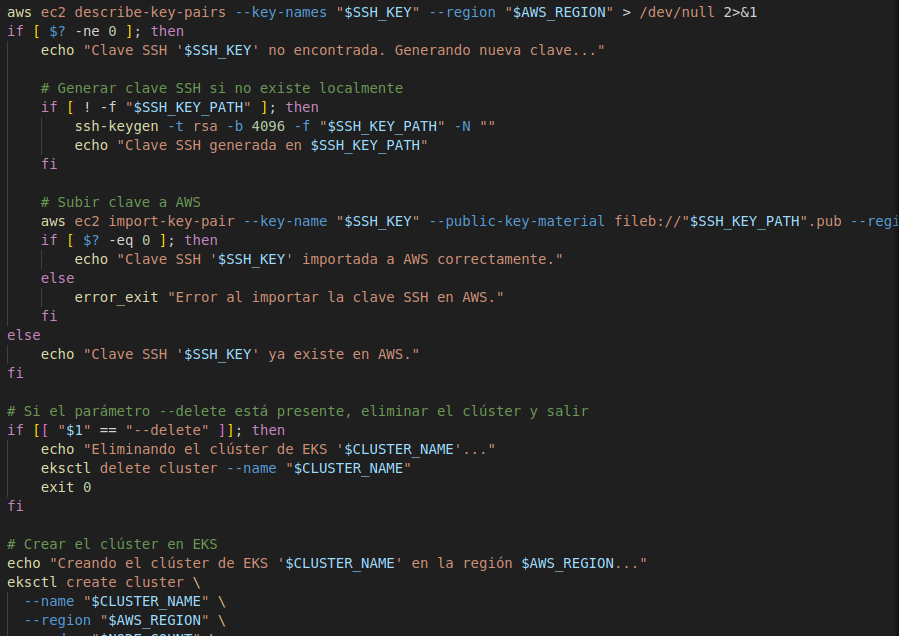

## Chequeo de cluster
Gracias a la integración de **eksctl** con **kubectl**, se puede chequear fácilmente lo desplegado como
por ejemplo los nodos:

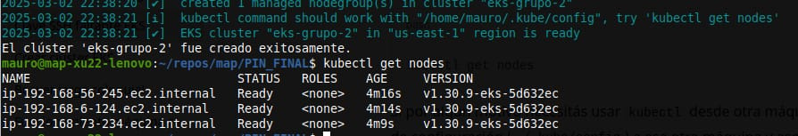

## Despliegue de Prometheus
La última parte consiste en desplegar el monitoreo de los pods a través de **Prometheus** y **Grafana**,
esto se logra con la integración de **helm** con **eksctl**. El primer paso es desplegar prometheus a
través de un script que chequea previamente si ya existe el namespace, en caso de que exista, se
borra, es una opción a utilizar --delete.

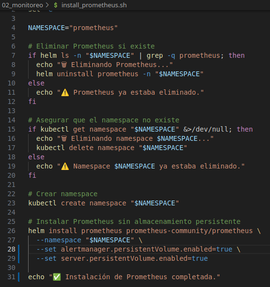

## Chequeo de despliegue de Prometheus
Como se mencionó antes, se puede pedir información de los pods que pertenecen al namespace
**prometheus**. Haciendo un port-forward al pod **prometheus-server**, se puede abrir termporalmente una
conexión a la interfaz web del mismo para asegurarnos que está funcionando bien. Esos avisos que
se ven en tiempo real son las conexiones que realiza el navegador web.

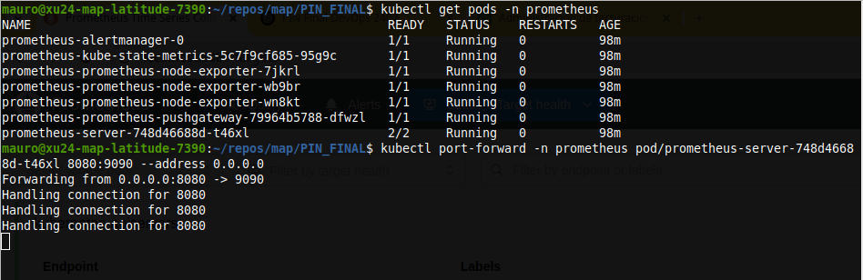

## Chequeo de despliegue de Prometheus
La dirección es **localhost:8080**. Se observa que Prometheus está scrapeando métricas de los nodos
del clúster y monitoreando tanto el estado del clúster como la API de Kubernetes.

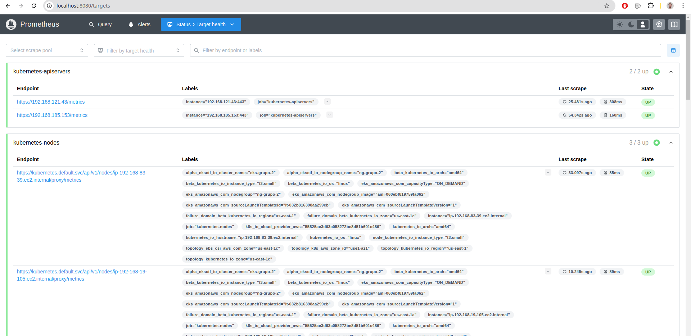

## Despliegue de Grafana
Se despliega **Grafana** con dos archivos. El script **grafana_deploy.sh** que utiliza **kubectl** para
crear en namespace y llamar a **helm**. Este último utiliza el archivo de configuración de valores
personalizados **grafana.yaml**.

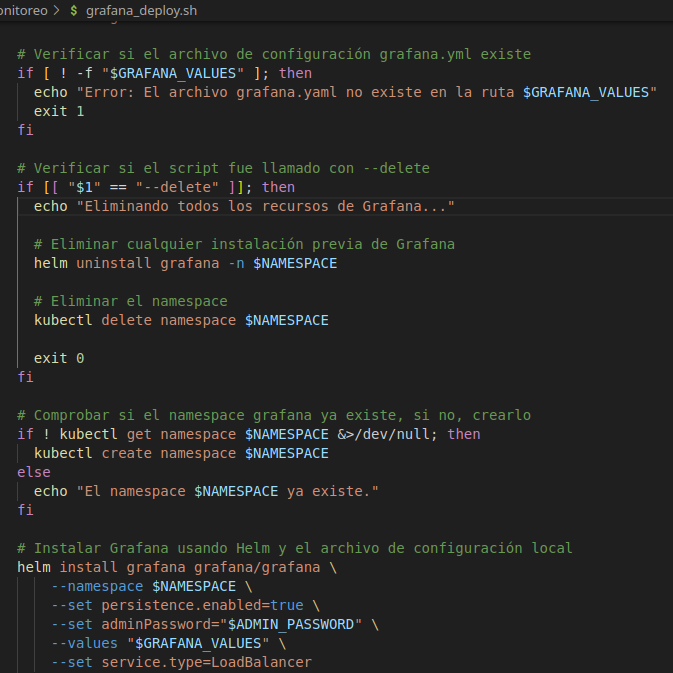

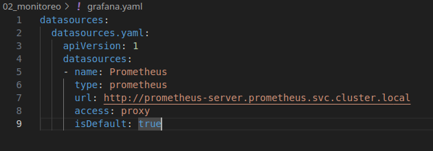

## Chequeo de despliegue de Grafana
Nuevamente se puede utilizar **kubectl** para obtener información, en este caso de todo lo
relacionado al namespace grafana. Se creo un pequeño script **get-grafana-info.sh** el cual devuelve
la dirección URL y contraseña del servicio para poder conectarse con el navegador web, útil para
el paso final.

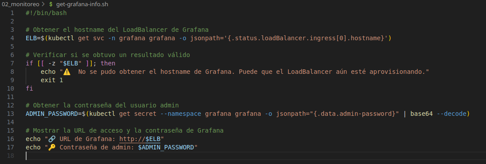

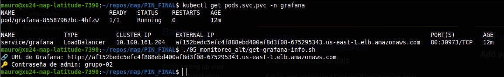

## Chequeo de despliegue de Grafana
Grafana sin dashboards aún.

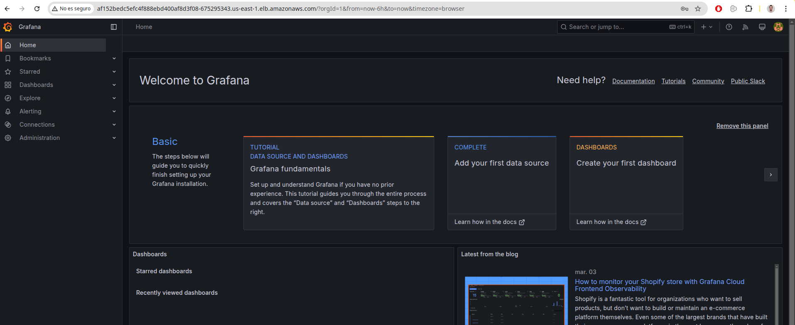

## Configuración de dashboard
Unas de las ventajas de usar Grafana es que se pueden **importar dashboards** con parámetros
predefinidos, esto se logra clickeando en **New dashboard -> Import**. Especificando el número 3119
y seleccionando a **Prometheus** como datasource se obtiene el **Cluster Monitoring Dashboard**.

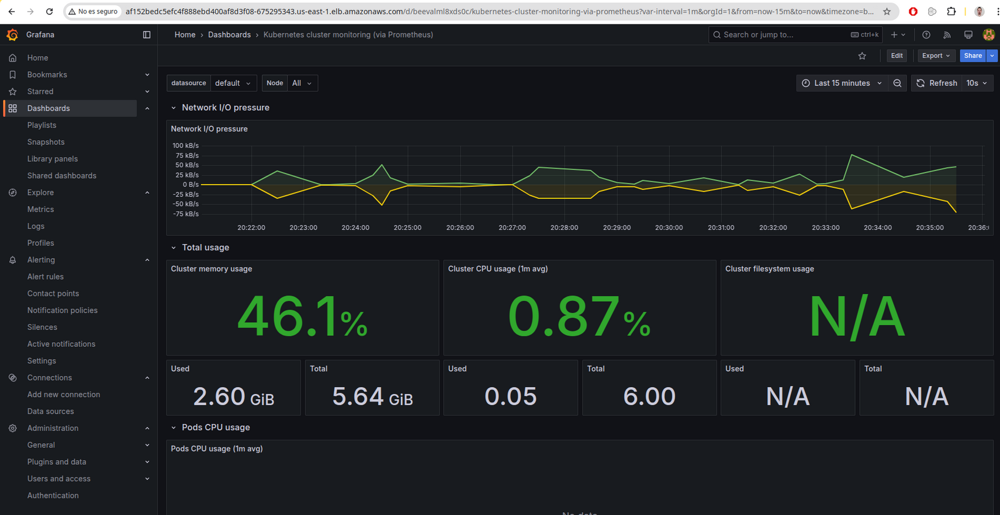

## Configuración de dashboard
Repitiendo los pasos pero esta vez agregando el número 6417 se obtiene el **Pods Monitoring
Dashboad**.

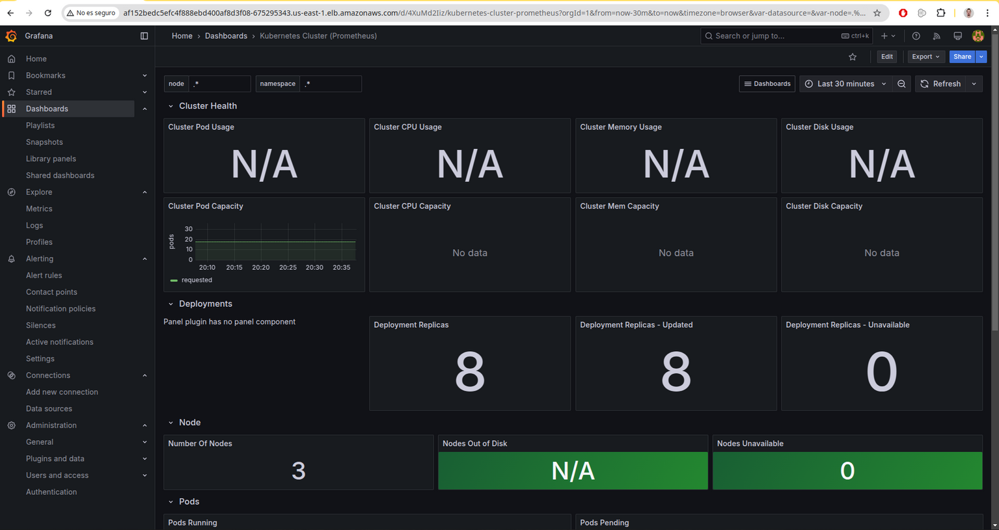

## Conclusión
* Elegir una buena herramienta de monitoreo facilita mucho el despliegue del mismo. La
importación de dashboard nos permite ganar tiempo, sin embargo al tener configuraciones
predefinidas es necesario retocar algunas, por eso algunos indicadores figuran como N/A.
* Es impresindible tener un buen manejo de costos a la hora de probar diferentes despliegues,
estar muy atentos a Cost Exporer de AWS y configurar las alertas.
* Se debe controlar que se hayan eliminado los clusteres si no se usan más o no se van a usar
por un buen tiempo, mantener limpia la nube, para no incurrir en costos desmedidos. Siempre
incluir algún algoritmo que se encargue de la eliminación, en nuestro caso el parámetro --
delete cumple dicho propósito. Si hubiéramos usado terraform tendríamos que ejecutar la
opción destroy.
* Otra buena práctica tener presente los permisos asignados a los usuarios. Tratar de siempre
darles los mínimos privilegios, manteniendo políticas ordenadas y límpias.

## PDF
[Presentación PIN FINAL - Grupo 02 - DEVOPS 2403.pdf](03_presentacion/Presentación%20PIN%20FINAL%20-%20Grupo%2002%20-%20DEVOPS%202403.pdf)

